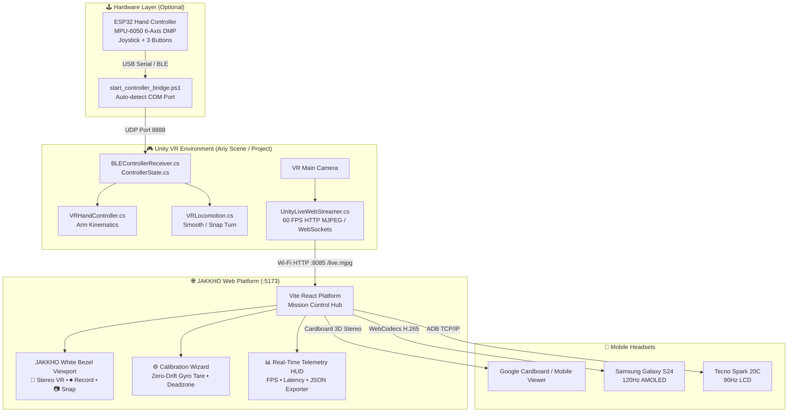

# JAK<◆>KHO VR Ecosystem
### Wireless OpenXR Live Streaming, Dual-Phone Headset Casting & DIY ESP32 Hand Controller


---

## 📖 Overview

**JAKKHO VR** is a modular, zero-wire Virtual Reality ecosystem designed for:
1. **Wireless Unity Live Streaming**: Broadcast any Unity 3D/VR scene viewport in real-time (60 FPS) over Wi-Fi directly to the web platform with **zero physical cables**.
2. **Branded Mission Control Web Platform**: A high-tech Vite + React frontend styled with custom white rounded bezel frames, live telemetry visualizers, and multi-device casting.
3. **🥽 Direct Stereo Cardboard VR Mode**: Dual-eye split-screen rendering with IPD (Interpupillary Distance 56–72mm) and lens zoom tuning for Google Cardboard, BoboVR, and mobile headsets.
4. **⏺ 1-Click Live Session Recorder & Snapshot**: In-browser hardware-accelerated WebM video recording (`.webm`) with live timer HUD and timestamped 4K snapshots (`.png`).
5. **⚙️ Calibration Wizard & Zero-Drift Gyro Tare**: Web-based deadzone adjustment, sensitivity gain, axis inversion, and 1-click zero-drift tare for MPU-6050 sensor fusion.
6. **📊 Real-Time Telemetry & JSON Diagnostic Exporter**: Live FPS counter, latency estimator, packet bitrate monitor, and 1-click JSON session export for research and team grading.
7. **DIY VR Hand Controller**: 6-DoF spatial wand powered by an ESP32 microcontroller, MPU-6050 6-Axis DMP fusion, analog thumb joystick, and tactile action buttons communicating via 80Hz binary packets.
8. **Dual Mobile Headset Support**: Hardware-accelerated WebCodecs H.264/H.265 streaming for Samsung Galaxy S24 (120Hz AMOLED) and Tecno Spark 20C (90Hz LCD).

---

## 🏗️ System Architecture



---

## 📂 Repository Structure

```text
├── simple.webplatform/            # Vite + React + Tailwind Web Platform
│   ├── src/
│   │   ├── components/
│   │   │   ├── SelectorSimulations/ # Mission Control Front Homepage (/)
│   │   │   ├── WebSocketManager/    # PlayerScreenCanvas (White Bezel Frame) & Streamers
│   │   │   ├── StreamPlayerScreen/  # Dedicated Fullscreen Casting View
│   │   │   ├── Header/ & Footer/    # Brand navigation & language selector
│   │   │   └── SimulationManager/   # Multiplayer simulation hub
│   │   └── api/                     # Backend streaming and monitoring servers
│   └── package.json
│
├── unity_scripts/Scripts/         # Universal Unity C# Components
│   ├── UnityLiveWebStreamer.cs    # 🌟 Universal Wi-Fi VR Camera Streamer (Port 8085)
│   ├── BLEControllerReceiver.cs   # UDP 8888 & BLE tracking receiver
│   ├── ControllerState.cs         # 20-byte binary packet unpacker
│   ├── VRHandController.cs        # Arm-kinematics 6-DoF wand tracker
│   ├── VRLocomotion.cs            # Joystick smooth/snap locomotion
│   ├── VRRaycaster.cs             # Physics raycasting & laser pointer
│   ├── GrabbableObject.cs         # Physics grab & kinematic manipulation
│   └── VRS24Manager.cs            # Android 120Hz AMOLED optimization
│
├── firmware/                      # ESP32 DIY VR Controller Arduino Code
│   └── esp32_vr_controller/
│       └── esp32_vr_controller.ino # 80Hz MPU-6050 DMP + Joystick + Button firmware
│
├── cadt_vr_display/               # Scrcpy & WebCodecs hardware streaming core
├── start_controller_bridge.ps1    # PowerShell USB Serial -> UDP 8888 telemetry bridge
├── serial_bridge.py               # Python serial bridge alternative
└── README.md                      # Project master documentation
```

---

## 🚀 1-Click Desktop Setup (For Any User / PC)

Anyone can clone and run this on their computer with zero manual configuration:

### Option A: 1-Click Desktop Icon Setup (Recommended)
1. **Clone the repository**:
   ```bash
   git clone https://github.com/Arno-1710/Jakkho-VR.git
   cd Jakkho-VR
   ```
2. Double-click **`Install_Desktop_Shortcut.bat`**.
3. A **`Launch JAKKHO VR Cast`** shortcut will appear on your Windows Desktop. Double-clicking it automatically installs dependencies, detects your local Wi-Fi IP, and opens your browser directly into the stream!

---

### Option B: Run from PowerShell or Terminal
```powershell
# In repository root:
.\start_webcasting.ps1
```
*(Or double-click `start_webcasting.bat` directly from Windows Explorer).*

---

## 🌐 Live Casting Website Guide

The **JAKKHO VR Webcasting Platform** is a 16:9 widescreen, 1080p 60 FPS live broadcast station built to view Unity PC VR games and Meta Quest wireless headsets in real time.

### 🔗 Direct URL Access Points:
| Target Device / Client | URL | Description |
| :--- | :--- | :--- |
| **Local PC Browser** | `http://localhost:5173/cast` | Fullscreen live casting viewport |
| **Mission Control Home** | `http://localhost:5173/` | Interactive dashboard with telemetry & controls |
| **Meta Quest / Mobile (Wi-Fi)** | `http://<YOUR_LAN_IP>:5173/cast` | In-headset browser or phone viewer |
| **Multi-View Grid** | `http://<YOUR_LAN_IP>:5173/streamPlayerScreen` | Simultaneous Unity + Headsets multi-stream |
| **Direct MJPEG (VLC / OBS / TV)** | `http://<YOUR_LAN_IP>:8085/stream.mjpg` | Raw video stream without Node.js |

---

### 🎮 How to Stream from Unity (Universal Compatibility)

The included [`UnityLiveWebStreamer.cs`](./unity_scripts/Scripts/UnityLiveWebStreamer.cs) script works across **any Unity version** (Unity 2019, 2020, 2021, 2022, Unity 6+) and **any render pipeline** (Built-in Standard, URP, or HDRP).

#### 1. Drop into your Unity Project:
* Copy [`UnityLiveWebStreamer.cs`](./unity_scripts/Scripts/UnityLiveWebStreamer.cs) into your project's `Assets/Scripts/` folder.
* **Auto-Attach**: If you do not attach it manually, it will **automatically attach itself to your Main Camera** the moment you press Play!

#### 2. Unity Top Menu Shortcuts:
* In the Unity Editor menu bar, click:
  * **`JAKKHO VR` ➔ `Open Webcast in Browser (5173)`**: Opens the live casting page in your browser.
  * **`JAKKHO VR` ➔ `Open Direct MJPEG Stream (8085)`**: Opens the direct video stream.

#### 3. Inspector Settings:
Select your Camera with `UnityLiveWebStreamer` attached to tune stream parameters:
* **`Target FPS`** (Default `60`): Target framerate (15–60 FPS).
* **`Stream Height`** (Default `1080`): Resolution height (1080p widescreen).
* **`JPG Quality`** (Default `90`): Visual fidelity (20–95%).
* **`Auto Open Browser On Play`** (Optional): Automatically launches Chrome/Edge to the cast whenever you press **Play ▶️**.
* **`HTTP Port`** (Default `8085`): Local video broadcast port.

---

### 🎛️ Live Casting Features & Controls

1. **🖥️ 16:9 Widescreen & Fullscreen Mode**:
   * All viewports automatically scale to 16:9 cinematic aspect ratio.
   * Press **`F`** on your keyboard or click the **Fullscreen (⛶)** button to enter borderless theater casting.
2. **⚡ Zero-Refresh Instant Reconnect**:
   * The web platform actively probes for stream signals every 800ms. The instant Unity enters Play mode, the stream attaches automatically without manual page refreshes.
3. **📷 High-Resolution Snapshots**:
   * Click **`📷 Snap`** in the control bar to capture a full-resolution JPEG frame and automatically download it to your PC with an on-screen toast confirmation.
4. **🔲 Multi-View Grid Mode (`Active Source: Grid`)**:
   * In the top control bar, select **`Grid`** to monitor the **Unity PC Camera** and **Meta Quest Headset feeds** simultaneously in a side-by-side or 2×2 layout.
5. **🥽 3D Stereo Cardboard VR Mode**:
   * Click the **`🥽 Stereo VR`** button to split the stream into Left and Right eye viewports with adjustable IPD (56–72mm) and zoom controls for mobile VR headsets.
6. **⚙️ Gyro Calibration & Zero-Drift Tare**:
   * Live deadzone adjustment, pitch/yaw inversion, sensitivity sliders, and a **`Zero Tare`** button to re-center spatial orientation.
7. **📊 Live Telemetry HUD & JSON Exporter**:
   * Real-time monitoring of FPS, network latency (ms), and bitrate (Mbps), with 1-click **Export Telemetry (JSON)** for experiment logging.

---

### 🥽 Meta Quest & Mobile Wireless Viewing Guide

1. Make sure your Meta Quest (or phone/tablet) is connected to the **same Wi-Fi network** as your PC.
2. In the Quest headset, open the built-in **Meta Quest Browser**.
3. Type your PC's LAN IP address: `http://<YOUR_PC_IP>:5173/cast` (e.g. `http://192.168.1.50:5173/cast`).
4. Click the **Fullscreen** button inside the browser to watch your Unity PC rendering live on a massive virtual cinema screen inside VR!

---

### ❓ Troubleshooting & FAQ

* **"This site can't be reached / localhost refused to connect"**:
  * Make sure the web server is running by double-clicking `start_webcasting.bat` or executing `.\start_webcasting.ps1` in PowerShell.
* **"Standby • Waiting for Stream"**:
  * Unity is not currently running the stream. Press **Play ▶️** in the Unity Editor to start streaming.
* **Quest / Phone cannot connect to the PC's IP**:
  * Check that both devices are on the same Wi-Fi router/hotspot.
  * Ensure Windows Defender Firewall allows Node.js / Port `5173` and `8085` on Private networks.

---

### 3. (Optional) Connect ESP32 DIY Hand Controller

#### Wiring Pinout:
| Component | ESP32 Pin | Function |
| :--- | :--- | :--- |
| **MPU-6050 SDA** | GPIO 21 | I2C Data |
| **MPU-6050 SCL** | GPIO 22 | I2C Clock |
| **MPU-6050 VCC/GND** | 3.3V / GND | Power |
| **Trigger Button** | GPIO 25 | Action 1 (Pull-up) |
| **Grip Grab Button** | GPIO 26 | Action 2 (Pull-up) |
| **Recenter Button** | GPIO 27 | Tare / Re-align (Pull-up) |
| **Joystick VRX (X-Axis)** | GPIO 34 | Analog Thumb X |
| **Joystick VRY (Y-Axis)** | GPIO 35 | Analog Thumb Y |
| **Joystick SW (Click)** | GPIO 32 | Thumbstick Click (Pull-up) |

#### Flash Firmware & Run Bridge:
1. Open [`esp32_vr_controller.ino`](./firmware/esp32_vr_controller/esp32_vr_controller.ino) in Arduino IDE and flash to your ESP32 board.
2. Close the Arduino Serial Monitor.
3. In PowerShell, run:
   ```powershell
   powershell -ExecutionPolicy Bypass -File .\start_controller_bridge.ps1
   ```
4. The bridge will auto-detect your USB COM port and stream 80Hz packets to Unity on UDP `127.0.0.1:8888`.

---

## 🛠️ Configuration & Customization

### Unity Stream Settings (`UnityLiveWebStreamer.cs`)
* **Target FPS** (Default `30`): Range `15`–`60` FPS.
* **Stream Height** (Default `720p`): Range `360p`–`1080p`.
* **JPEG Quality** (Default `70`): Lower = lower latency (<20ms); Higher = crisper visual fidelity.
* **HTTP Port** (Default `8085`): Local HTTP MJPEG server port.

### Web Platform Ports
* **`5173`**: Vite React Frontend Development Server.
* **`8085`**: Unity Live MJPEG Video Stream Server.
* **`8082`**: Video WebCodecs H.264/H.265 Streaming Server (for Android/Quest).
* **`8001`**: Monitoring & Simulation WebSocket Server.

---

## 👥 Team Contribution Guidelines

1. **Pull the latest changes**:
   ```bash
   git checkout main
   git pull origin main
   ```
2. **Create a feature branch**:
   ```bash
   git checkout -b feature/your-feature-name
   ```
3. **Commit and push**:
   ```bash
   git add .
   git commit -m "feat(ui): refine dashboard layout"
   git push origin feature/your-feature-name
   ```

---

## 📄 License
MIT License © 2026 JAKKHO VR Team.
